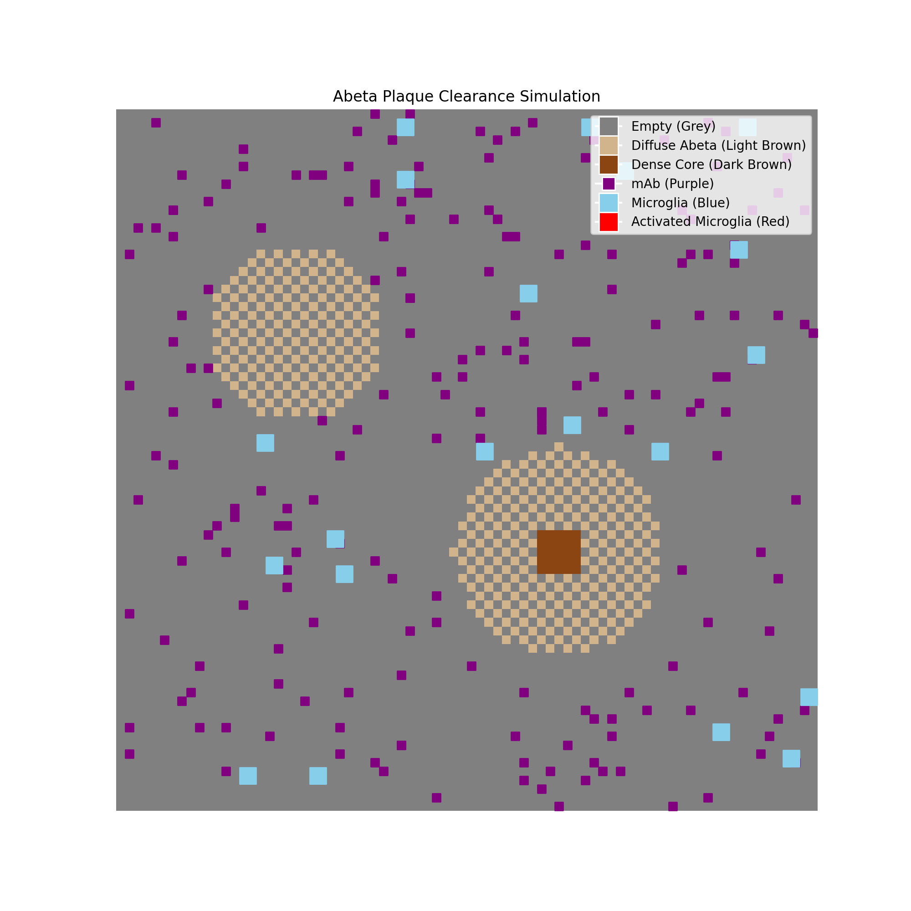

# Abeta Plaque Clearance Agent-Based Model



This project is an agent-based model (ABM) designed to simulate the clearance of Amyloid Beta (Abeta) plaques by Microglia and monoclonal Antibodies (mAbs).

## Features
- **Environment**: A grid-based space with two types of plaques:
  - **Diffuse Plaques**: Checkerboard pattern of low-concentration Abeta.
  - **Dense Core Plaques**: Checkerboard pattern with a 5x5 high-concentration core.
- **Agents**:
  - **mAbs (Purple)**: Random walkers that stick to plaques upon contact.
  - **Microglia (Blue/Red)**: 2x2 agents random walkers while in an inactive (blue) state.
- **Microglia Dynamics**:
  - **Activation**: Microglia sense stuck mAbs within a detection radius. If >4 mAbs are detected near a plaque, the microglia activates (turns red) and jumps to the plaque.
  - **Clearance**: Activated microglia clear 1 unit of Abeta concentration from a random plaque cell within their detection radius per step.
  - **Deactivation**: If no plaque remains within the detection radius, the microglia deactivates, turns blue, and releases any stuck mAbs in the area, allowing it to start moving again.

## Model Assumptions
The following assumptions define the behavior of the agents and the environment in this simulation:

1.  **Plaque Composition**:
    -   **Diffuse Plaques**: Modeled as a checkerboard pattern of cells with 1 unit of Abeta concentration.
    -   **Dense Core Plaques**: Modeled similarly to diffuse plaques but contain a central 5x5 core where all cells have 2 units of Abeta concentration.

2.  **Monoclonal Antibodies (mAbs)**:
    -   **Movement**: mAbs are random walkers that move one step in any direction (including diagonals) per iteration.
    -   **Binding**: They cannot inhabit a cell occupied by a plaque without binding to it. Upon entering a cell with Abeta concentration > 0, they immediately stick and stop moving.
    -   **Persistence**: Stuck mAbs do not unbind or degrade over time unless the underlying plaque is fully cleared by microglia. They are initialized at the start and no new mAbs are born during the simulation.

3.  **Microglia**:
    -   **Movement**: Microglia are 2x2 agents that random walk through the environment. They cannot move onto or through plaque cells while in their resting (inactive) state.
    -   **Activation**: Microglia possess a detection radius of 6 cells (effectively checking a 14x14 area centered on themselves). If they detect more than 4 stuck mAbs *and* at least one plaque cell within this radius, they become **activated** (turn red).
    -   **Action upon Activation**: When activated, the microglia jumps to a random plaque cell within its detection range. It remains stationary while activated.
    -   **Clearance**: In each time step, an activated microglia selects exactly **one** random cell with non-zero Abeta concentration within its detection radius and reduces its concentration by 1 unit.
    -   **Deactivation**: If no plaque cells remain within the detection radius, the microglia returns to its resting state (blue), releases any stuck mAbs in the area (allowing them to move again), and resumes random walking.

## Requirements
- Python 3.12
- NumPy
- Matplotlib

## Installation
1. Create a virtual environment:
   ```bash
   python3.12 -m venv venv
   source venv/bin/activate
   ```
2. Install dependencies:
   ```bash
   pip install -r requirements.txt
   ```

## Usage
Run the interactive simulation:
```bash
python main.py
```

To regenerate the demo GIF:
```bash
python generate_demo.py
```
*Note: The demo at the top shows a simulation starting from step 0 with 200 mAbs and 20 Microglia.*
